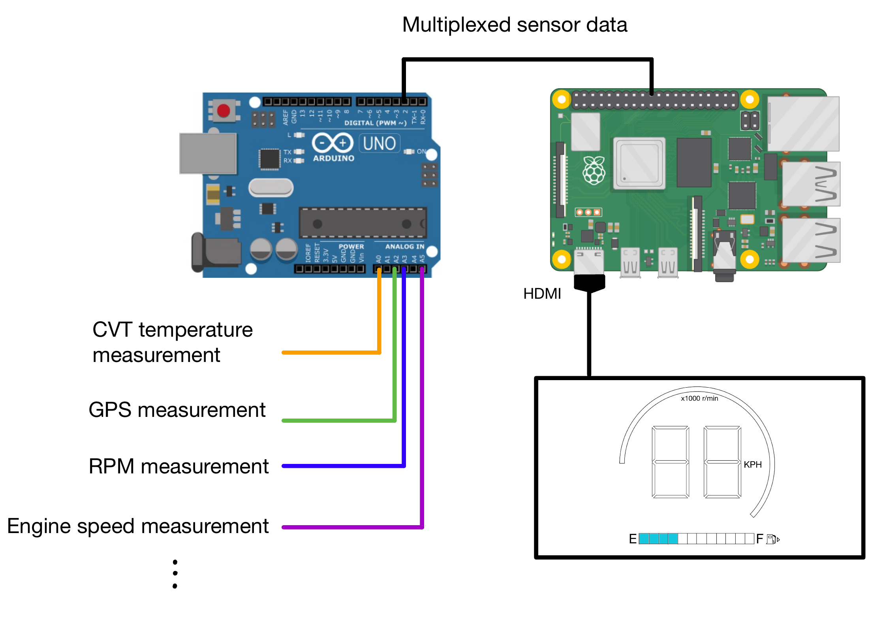
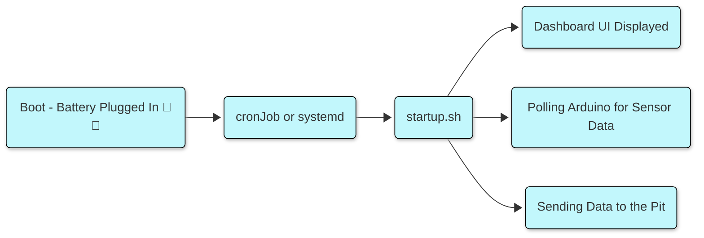
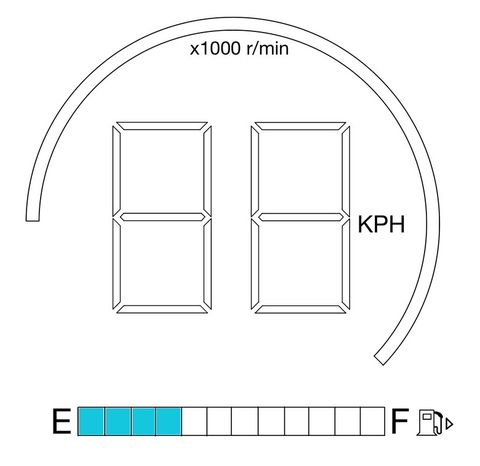

# Baja Dashboard Design Document

## Introduction:

The goal of this project is to create a dashboard for a Baja car, providing the driver with essential information. The data will be displayed on the UI and possibly logged and/or sent to the pit for monitoring and analysis.

## System overview:

The measurements required for the display will be made through sensors connected to an Arduino. These will be converted to the actual values and then sent over to the raspberry pi via UART. The dashboard application running on the raspberry pi needs to read these values and display them on the screen via an HDMI connection:  

## 

## Specifications

Software:

* The raspberry pi will acquire sensor data from an arduino connected to it via the UART  
* The raspberry pi will run Raspbian OS

Hardware:

* The UI will be displayed on a 1024x600 screen via HDMI  
* A plexiglass case will be used to protect the screen  
* We will use a LoRa module to send data from the pi to the pit.

## Requirements:

* The raspberry pi should acquire sensor data from the arduino.  
* The following should be displayed on the UI  
  * Speed (KPH)  
  * Fuel level (percentage)  
  * RPM of the motor  
  * CVT temperature (°C)  
* The software should be reusable and be easy to change for a different screen size (screen might break)  
* The critical information should be displayed very clearly since the car will be shaking and or have mud/dust on the screen  
* The screen has to be robust attached to the cart  
* There needs to be some form of protection for the screen so that it doesn’t get damaged and we can wash it easily(mud and dust).  
* There needs to be a message displayed if the data connection with the Arduino is lost (will help debugging if something goes wrong)

## Possible additional Features:

* Send data to the pit by connecting a LoRa module to the raspberry pi  
* Luminosity controls for the screen (might blind the driver at night)  
* Logging the data (push button?)

## System Architecture:

* The code will be stored in this **GitHub repository**: [https://github.com/MaximeCourchesne/BajaCarDashboard](https://github.com/MaximeCourchesne/BajaCarDashboard)

* We will be using mostly python for this project because of the availability of graphic libraries and ease of integration with the raspberry pi.

* We will keep the default raspbian OS because it is lightweight and there is a lot of  documentation on how to interact with the hardware. Another choice of OS could cause problems and we cannot see any benefit to using a different OS.  
    
* The code for data handling, sending data to pit and the UI should be clearly separated  
    
* The PyGame library will be used to create the UI (might change later)

* Actions on boot of the raspberry pi:

## 

## 

## 

## UI design:

Features to be added to the design:

* CVT temperature

Features that are nice to have but not required

* Previous lap time  
* Current lap time  
* Current delta (with last lap)

Current Design:  

## Testing:

We will have a test script on the arduino that will simulate an actual run of the car by outputting already acquired from a previous run.

## Timeline

The UI’s required features(see requirements) need to be implemented before January 1st.

## Questions and Answers:

Q: Will a LoRa module have enough range to send the car data to the pit?  
A:

Q: How will the testing be done?  
A: We have test data collected by the arduino that we could use to test our UI by simulating a run. However the tank capacity cannot be measured yet (another team member in currently working on it)

Q: How will we be sending data to the pit?  
A: Lora modules would be a great option for this \- currently have one designed for another club which could serve this purpose.  
	
