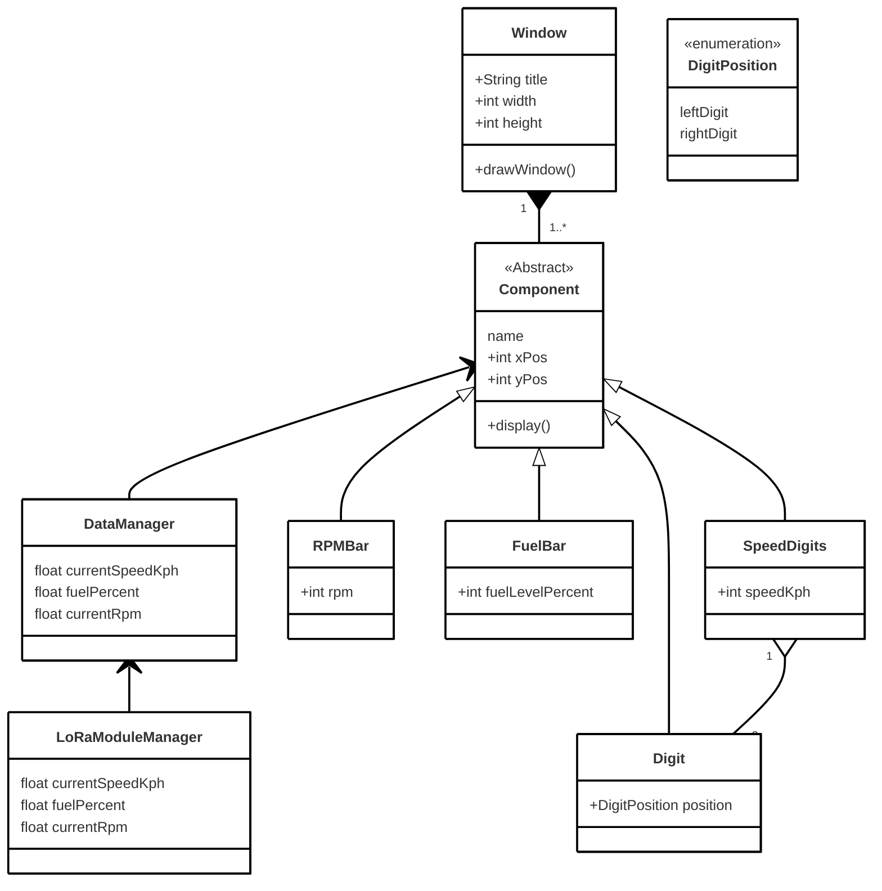

## Class Diagram

```mermaid
---
config:
  theme: neo
---
classDiagram
    class Component {
        <<Abstract>>
        name
        +int xPos
        +int yPos
        +display()
    }
    class Digit {
        +DigitPosition position
    }
    class SpeedDigits {
        +int speedKph
    }
    class RPMBar {
        +int rpm
    }
    class FuelBar {
        +int fuelLevelPercent
    }
    class Window {
        +String title
        +int width
        +int height
        +drawWindow()
    }
    class DataManager {
        float currentSpeedKph
        float fuelPercent
        float currentRpm
    }
    class LoRaModuleManager {
        float currentSpeedKph
        float fuelPercent
        float currentRpm
    }
    class DigitPosition {
        <<enumeration>>
        leftDigit
        rightDigit
    }
    DataManager <-- LoRaModuleManager
    Component <-- DataManager
    Component <|-- SpeedDigits
    Component <|-- Digit
    SpeedDigits "1" o-- "2" Digit
    Window "1" *-- "1..*" Component
    Component <|-- RPMBar
    Component <|-- FuelBar
```
